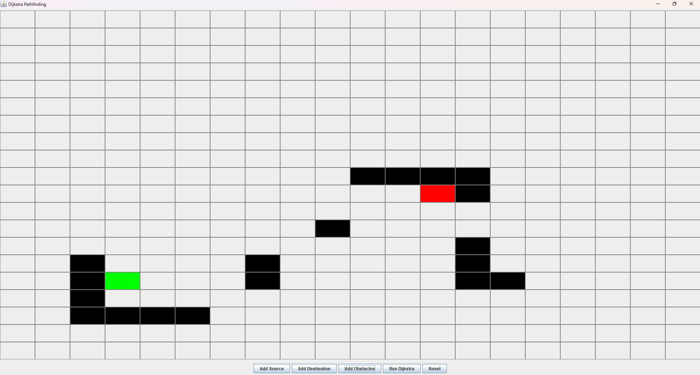
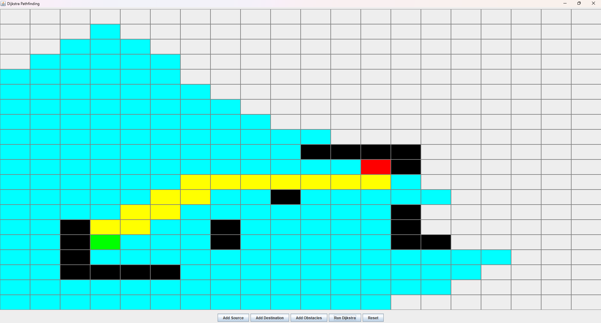

# ShortestPathFinder

## Project Description
**ShortestPathFinder** is a Java-based application that visualizes Dijkstra's algorithm for finding the shortest path between two points on a grid. It allows users to set a source, destination, and obstacles, and see how the algorithm explores paths and eventually finds the shortest one.

This project is intended for educational purposes, providing an interactive way to learn about Dijkstra's algorithm and its functionality in pathfinding scenarios.

## Features
- Visualize the exploration of paths in real-time.
- Set a source, destination, and add obstacles.
- See how Dijkstra's algorithm finds the shortest path.
- Clean and reset the grid for multiple uses.
- User-friendly GUI with color-coded cells (green for source, red for destination, black for obstacles, yellow for the shortest path).

## Installation Instructions

1. **Clone the repository**:
    ```bash
    git clone https://github.com/RAJAY04/ShortestPathFinder
    ```

2. **Build and run the visualizer**:
    ```bash
    cd ShortestPathFinder/src
    javac -d ../out/production/Dikstras Algorithm/DijkstraAlgorithm.java Visualiser/DijkstraVisualizer.java
    java -cp ../out/production/Dikstras Visualiser.DijkstraVisualizer
    ```

   Alternatively, you can use an IDE like IntelliJ or Eclipse to run the project directly.

## Usage

1. **Run the application**:
    - Use the buttons below the grid to select your actions:
        - **Add Source**: Click on a cell to set the starting point (green).
        - **Add Destination**: Click on a cell to set the end point (red).
        - **Add Obstacles**: Click on cells to add walls/obstacles (black).

2. **Visualize the Algorithm**:
    - After setting the source and destination, click **Run Dijkstra** to visualize the algorithm exploring the grid. Paths will be explored in real-time.

3. **Reset the Grid**:
    - Click the **Reset** button to clear the grid and start over.

## How Dijkstra's Algorithm Works
Dijkstra's algorithm is a greedy algorithm that finds the shortest path between two points in a weighted grid. Here's a breakdown of how it works in this project:

1. The grid consists of cells, and the algorithm starts at the source.
2. The algorithm explores all neighboring cells, calculating the shortest distance to each.
3. As the algorithm moves, it keeps track of visited cells and updates the distance for each cell.
4. It continues exploring until it reaches the destination.
5. Finally, it backtracks to display the shortest path.

In this visualization, explored cells are shown in blue, and the final shortest path is highlighted in yellow.

## Example Images

### 1. Before Running Dijkstra's Algorithm
- The source (green), destination (red), and obstacles (black) are set.



### 2. Shortest Path
- Dijkstra's algorithm explores the paths and finds the shortest route (yellow).



## Contributing
If you'd like to contribute to this project, feel free to fork the repository and submit pull requests. Contributions can include improvements to the visualization.
